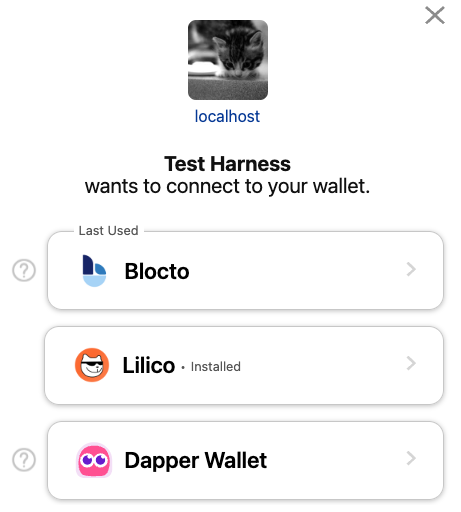

[](https://github.com/onflow/flow-js-sdk/actions/workflows/integrate.yml)
[](https://lerna.js.org/)

<br />
<br />
<p align="center">
  <h1 align="center"> FCL JS</h1>
  <p align="center">
    <i>Connect your dapp to users, their wallets and Flow.</i>
    <br />
    <br />
    <a href="https://developers.flow.com/tutorials/flow-app-quickstart">Quickstart</a>
    ·
    <a href="https://github.com/onflow/fcl-js/issues">Report Bug</a>
    ·
    <a href="https://github.com/onflow/fcl-js/blob/master/CONTRIBUTING.md">Contribute</a>

  </p>
</p>

## What is FCL?

The Flow Client Library (FCL) JS is a package used to interact with user wallets and the Flow blockchain. When using FCL for authentication, dapps are able to support all FCL-compatible wallets on Flow and their users without any custom integrations or changes needed to the dapp code.

It was created to make developing applications that connect to the Flow blockchain easy and secure. It defines a standardized set of communication patterns between wallets, applications, and users that is used to perform a wide variety of actions for your dapp. FCL also offers a full featured SDK and utilities to interact with the Flow blockchain.

While FCL itself is a concept and standard, FCL JS is the javascript implementation of FCL and can be used in both browser and server environments. All functionality for connecting and communicating with wallet providers is restricted to the browser. We also have FCL Swift implementation for iOS, see [FCL Swift](https://github.com/Outblock/fcl-swift) contributed by [@lmcmz](https://github.com/lmcmz).

---
## Getting Started

### Requirements
-  Node version `v12.0.0 or higher`.

### Build
```shell
npm i
npm run build
```

### Release
Packages stable versions releases are controlled by [changesets](https://github.com/changesets/changesets) from the `master` branch

#### Prerelease(alpha)
In order to create an `alpha` (pre-)release 
- create a branch with `release-<VERSION>` as a branch name
- run:
```
npm run changeset pre enter alpha
npm run changeset version
npm run changeset publish
```

*NOTE: you need to have an npm account and be a member of [OnFlow organization](https://www.npmjs.com/org/onflow)*

`changeset` commands should preferably be run from the `release` branch and not from feature branches in order to avoid merge conflicts with other feature branches
when the release is ready to be published as stable run from the release branch
```
npm run changeset pre exit
```
and merge `release-<VERSION>` branch to `master`

### Installation

To use the FCL JS in your application, install using **yarn** or **npm**

```shell
npm i -S @onflow/fcl
```

```shell
yarn add @onflow/fcl
```
#### Importing

**ES6**
```js
import * as fcl from "@onflow/fcl";
```
**Node.js**
```js
const fcl = require("@onflow/fcl");
```
---
## FCL for Dapps
#### Wallet Interactions

- *Wallet Discovery* and *Sign-up/Login*: Onboard users with ease. Never worry about supporting multiple wallets. 
Authenticate users with any [FCL compatible wallet](#current-wallet-providers).
```js
// in the browser
import * as fcl from "@onflow/fcl"

fcl.config({
  "discovery.wallet": "https://fcl-discovery.onflow.org/testnet/authn", // Endpoint set to Testnet
})

fcl.authenticate()
```


> **Note**: A [Dapper Wallet](https://meetdapper.com/developers) developer account is required. To enable Dapper Wallet inside FCL, you need to [follow this guide](https://docs.meetdapper.com/get-started).

- *Interact with smart contracts*: Authorize transactions via the user's chosen wallet 
- *Prove ownership of a wallet address*: Signing and verifying user signed data

[Learn more about wallet interactions >](https://developers.flow.com/tooling/fcl-js/api#wallet-interactions)

#### Blockchain Interactions
- *Query the chain*: Send arbitrary Cadence scripts to the chain and receive back decoded values
```js
import * as fcl from "@onflow/fcl";

const result = await fcl.query({
  cadence: `
    pub fun main(a: Int, b: Int, addr: Address): Int {
      log(addr)
      return a + b
    }
  `,
  args: (arg, t) => [
    arg(7, t.Int), // a: Int
    arg(6, t.Int), // b: Int
    arg("0xba1132bc08f82fe2", t.Address), // addr: Address
  ],
});
console.log(result); // 13
```
- *Mutate the chain*: Send arbitrary transactions with your own signatures or via a user's wallet to perform state changes on chain.
```js
import * as fcl from "@onflow/fcl";
// in the browser, FCL will automatically connect to the user's wallet to request signatures to run the transaction
const txId = await fcl.mutate({
  cadence: `
    import Profile from 0xba1132bc08f82fe2
    
    transaction(name: String) {
      prepare(account: AuthAccount) {
        account.borrow<&{Profile.Owner}>(from: Profile.privatePath)!.setName(name)
      }
    }
  `,
  args: (arg, t) => [arg("myName", t.String)],
});
```

[Learn more about on-chain interactions >](https://developers.flow.com/tooling/fcl-js/api#on-chain-interactions)

#### Utilities
- Get account details from any Flow address
- Get the latest block
- Transaction status polling
- Event polling
- Custom authorization functions

[Learn more about utilities >](https://developers.flow.com/tooling/fcl-js/api#pre-built-interactions)

## Typescript Support

FCL JS supports TypeScript. If you need to import specific types, you can do so via the [@onflow/typedefs](./packages/typedefs/README.md) package.

```typescript
import {CurrentUser} from "@onflow/typedefs"

const newUser: CurrentUser = { 
  addr: null,
  cid: null,
  expiresAt: null,
  f_type: 'User',
  f_vsn: '1.0.0',
  loggedIn: null,
  services: []
}
```

For all type definitions available, see [this file](./packages/typedefs/src/index.js)

## Next Steps

See the [Flow App Quick Start](https://developers.flow.com/tutorials/flow-app-quickstart).

See the full [API Reference](https://developers.flow.com/tooling/fcl-js/api) for all FCL functionality.

Learn Flow's smart contract language to build any script or transactions: [Cadence](https://developers.flow.com/cadence).

Explore all of Flow [docs and tools](https://developers.flow.com).


---
## FCL for Wallet Providers
Wallet providers on Flow have the flexibility to build their user interactions and UI through a variety of ways:
- Front channel communication via Iframe, pop-up, tab, or extension
- Back channel communication via HTTP

FCL is agnostic to the communication channel and be configured to create both custodial and non-custodial wallets. This enables users to interact with wallet providers without needing to download an app or extension.

The communication channels involve responding to a set of pre-defined FCL messages to deliver the requested information to the dapp.  Implementing a FCL compatible wallet on Flow is as simple as filling in the responses with the appropriate data when FCL requests them. If using any of the front-channel communication methods, FCL also provides a set of [wallet utilities](https://github.com/onflow/fcl-js/blob/master/packages/fcl-core/src/wallet-utils/index.js) to simplify this process.


### Current Wallet Providers
- [Blocto](https://blocto.portto.io/en/)
- [Ledger](https://ledger.com) (limited transaction support)
- [Dapper Wallet](https://www.meetdapper.com/) (beta access - general availability coming soon)
- [Lilico Wallet](https://lilico.app/) Fully non-custodial chrome extension wallet focused on NFTs

### Wallet Discovery
It can be difficult to get users to discover new wallets on a chain. To solve this, we created a [wallet discovery service](https://github.com/onflow/fcl-discovery) that can be configured and accessed through FCL to display all available Flow wallet providers to the user. This means:
- Dapps can display and support all FCL compatible wallets that launch on Flow without needing to change any code
- Users don't need to sign up for new wallets - they can carry over their existing one to any dapp that uses FCL for authentication and authorization.

The discovery feature can be used via API allowing you to customize your own UI or you can use the default UI without any additional configuration.

> Note: To get your wallet added to the discovery service, make a PR in [fcl-discovery](https://github.com/onflow/fcl-discovery).

### Building a FCL compatible wallet

- Read the [wallet guide](https://github.com/onflow/fcl-js/blob/master/packages/fcl-core/src/wallet-provider-spec/draft-v3.md) to understand the implementation details.
- Review the architecture of the [FCL dev wallet](https://github.com/onflow/fcl-dev-wallet) for an overview.
- If building a non-custodial wallet, see the [Account API](https://github.com/onflow/flow-account-api) and the [FLIP](https://github.com/onflow/flow/pull/727) on derivation paths and key generation.

---

## Support

Notice a problem or want to request a feature? [Add an issue](https://github.com/onflow/flow-js-sdk/issues).

Discuss FCL with the community on the [forum](https://forum.onflow.org/c/developer-tools/flow-fcl/22).

Join the Flow community on [Discord](https://discord.gg/k6cZ7QC) to keep up to date and to talk to the team.
