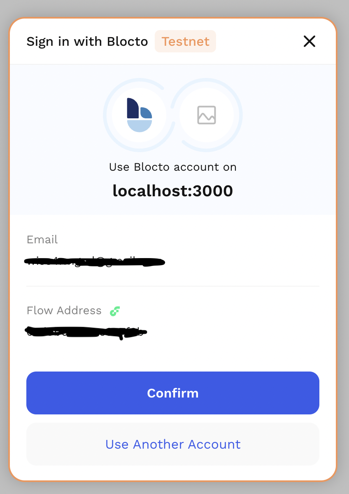

In authentication, a user or application proves they are who they say they are by providing valid credentials.
Authentication is essential in any application or system to keep the user's data safe and adequately access information.

Also, the concept of authentication in FCL is tied closely to FCL's concept of currentUser. In fact, `fcl.authenticate` and `fcl.unauthenticate` are both aliases to `fcl.currentUser.authenticate()` and `fcl.currentUser.unauthenticate()` respectively.

## How FCL authentication works
Authentication is triggered either through Discovery or default configuration (fcl.config.discovery.wallet).
- The Wallet Provider has an FCL Authentication URL: https://example.wallet/fcl/authn
- The Application lives at: https://example.app

First, configure FCL to point to the Wallet Providers Authentication URL:

```javascript
import {config} from "@onflow/config"

fcl.config().put("discovery.wallet","https://example.wallet/fcl/authn")
```
Next, the user authenticates by clicking a button(Eg, sign in button or something) to trigger the `fcl.authenticate`call.

```javascript
import React from "react"

export const Authenticate = () => (
  <button onClick={() => fcl.authenticate()}>Sign In/Up</button>
) 
```

Then, when `fcl.authenticate()` is triggered, It looks up the discovery wallet url with `fcl.config().put("discovery.wallet","")`. FCL will render an iframe using the discovery wallet Url at the src, also passing in several query parameters. 



Inside this iframe, everything is up to the wallet; once the wallet is confident the user is who they say they are, it will send (via postMessage) back to FCL a bunch of information (Eg, user data and services). This information configures FCL in the application for future user actions.

Here is an example of an authentication response:

```json
 {
    "f_type": "USER",
    "f_vsn": "1.0.0",
    "addr": "0xd9b64fa5ae9e7f3b",
    "cid": "ee88f086a545ce3c552da434613166616132342d303339392d346433372d393738382d616433356134316531633731",
    "loggedIn": true,
    "expiresAt": 1660833660075,
    "services": [
        {
            "f_type": "Service",
            "f_vsn": "1.0.0",
            "type": "authn",
            "uid": "blocto#authn",
            "id": "4a1faa24-0399-4d37-9788-ad35a41e1c71",
            "identity": {
                "address": ""
            },
            "scoped": {
                "email": ""
            },
            "provider": {
                "address": "",  
                "name": "Blocto",
                "icon": "https://blocto.portto.io/icons/icon-512x512.png",
                "description": "Blocto is your entrance to blockchain world."
            },
            "authn": "https://flow-wallet-testnet.blocto.app/authn"
        },
        {
            "f_type": "Service",
            "f_vsn": "1.0.0",
            "type": "authz",
            "uid": "blocto#authz",
            "method": "HTTP/POST",
            "identity": {
                "address": "",
                "keyId": 1,
                "addr": ""
            },
            "address": "",
            "addr": "",
            "keyId": 1,
            "endpoint": "https://flow-wallet-testnet.blocto.app/api/flow/authz",
            "params": {
                "sessionId": "fdIkGrDNi-xgYlTlV7bi"
            }
        },
        {
            "f_type": "Service",
            "f_vsn": "1.0.0",
            "type": "pre-authz",
            "uid": "blocto#pre-authz",
            "method": "HTTP/POST",
            "endpoint": "https://flow-wallet-testnet.blocto.app/api/flow/pre-authz",
            "params": {
                "sessionId": "fdIkGrDNi-xgYlTlV7bi"
            }
        },
        {
            "f_type": "Service",
            "f_vsn": "1.0.0",
            "type": "user-signature",
            "uid": "blocto#user-signature",
            "endpoint": "https://flow-wallet-testnet.blocto.app/user-signature",
            "method": "IFRAME/RPC",
            "id": "fdIkGrDNi-xgYlTlV7bi",
            "params": {
                "sessionId": "fdIkGrDNi-xgYlTlV7bi"
            }
        },
        {
            "f_type": "Service",
            "f_vsn": "1.0.0",
            "type": "open-id",
            "uid": "blocto#open-id",
            "method": "DATA",
            "data": {
                "f_type": "OpenID",
                "f_vsn": "1.0.0",
                "email": {
                    "email": "",
                    "email_verified": true
                }
            }
        },
        {
            "f_type": "Service",
            "f_vsn": "1.0.0",
            "type": "authz",
            "uid": "fdIkGrDNi-xgYlTlV7bi#authz-http-post",
            "endpoint": "https://flow-wallet-testnet.blocto.app/api/flow/authz",
            "method": "HTTP/POST",
            "identity": {
                "f_type": "Identity",
                "f_vsn": "1.0.0",
                "address": "",
                "keyId": 1
            },
            "params": {
                "sessionId": "fdIkGrDNi-xgYlTlV7bi"
            }
        },
        {
            "f_type": "Service",
            "f_vsn": "1.0.0",
            "type": "authn",
            "uid": "wallet-provider#authn",
            "endpoint": "https://flow-wallet-testnet.blocto.app/authn",
            "id": "d9b64fa5ae9e7f3b",
            "provider": {
                "address": "",
                "name": "Blocto",
                "icon": "https://blocto.portto.io/icons/icon-512x512.png"
            }
        }
    ]
}

```

The authentication process is complete once FCL receives a response configuring FCL with FCL Services for the current user. This response tells FCL who the user is. Then via the included services, it tells FCL the following:
- How the user is authenticated, 
- How to request transaction signatures, 
- How to get a personal message signed, 
- Shows the user's email and other details if requested. 

## Authentication (Authn) Service
This service is responsible for requesting information from a user, validating it against the configured identity, and providing enough proof that you are okay with passing their details back to FCL. 
FCL now has a Current User and should know how to talk to the wallet so that a transaction can be signed.

```json
   {
            "f_type": "Service",        // It's a service!
            "f_vsn": "1.0.0",           // Follows the v1.0.0 spec for the service
            "type": "authn",            // the type of service it is
            "uid": "blocto#authn",   // standard service uid
            "id": "4a1faa24-0399-4d37-9788-ad35a41e1c71",
            "identity": {
                "address": ""  // the address that the signature will be for
            },
            "scoped": {
                "email": ""
            },
            "provider": {
                "address": "", // provider address
                "name": "Blocto",
                "icon": "https://blocto.portto.io/icons/icon-512x512.png",
                "description": "Blocto is your entrance to blockchain world."
            },
            "authn": ""  // where to talk to the service
        }
 ```

## Two ways a Dapp can access the current user data
FCL provides two ways of getting the current user's information. 
- Snapshot of the current user
- Subscribe to the current user

### Snapshot of the current user
The snapshot method is an async method that will return the current user data once.

```javascript
import * as fcl from "@onflow/fcl"

const currentUser = await fcl.currentUser.snapshot()
console.log("The Current User", currentUser)
```

### Subscribe to the current user
The subscribe method provides support for dealing with real-time changes.
To make this work, you can pass the `subscribe method`  
to a callback function, which will call that `callback` function for the first time with all the data and anytime the data changes.

```javascript
import * as fcl from "@onflow/fcl"

// Returns an unsubscribe function
const unsubscribe = fcl.currentUser.subscribe(currentUser => {
  console.log("The Current User", currentUser)
})
```