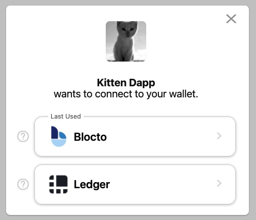

## Wallet Discovery

Knowing all the wallets available to users on a blockchain can be challenging. FCL's Discovery mechanism relieves much of the burden of integrating with Flow compatible wallets and let's developers focus on building their dapp and providing as many options as possible to their users.

There are two ways an app can use Discovery: 
 1. The **UI version** which can be configured for display via iFrame, Popup, or Tab.
 2. The **API version** which allows you to access authentication services directly in your code via `fcl.discovery.authn` method which we'll describe below.

## UI Version

When authenticating via FCL using Discovery UI, a user is shown a list of services they can use to login.



This method is the simplest way to integrate Discovery and its wallets and services into your app. All you have to do is configure `discovery.wallet` with the host endpoint for testnet or mainnet.

```javascript
import { config } from "@onflow/fcl";

config({
  "accessNode.api": "https://access-testnet.onflow.org", // Mainnet: "https://access-mainnet-beta.onflow.org"
  "discovery.wallet": "https://fcl-discovery.onflow.org/testnet/authn" // Mainnet: "https://fcl-discovery.onflow.org/authn"
})
```

Any time you call `fcl.authenticate` the user will be presented with that screen.

To change the default view from iFrame to popup or tab set `discovery.wallet.method` to `POP/RPC` (opens as a popup) or `TAB/RPC` (opens in a new tab). More info about service methods can be [found here](https://github.com/onflow/fcl-js/blob/9bce741d3b32fde18b07084b62ea15f9bbdb85bc/packages/fcl/src/wallet-provider-spec/draft-v3.md).

### Branding Discovery UI

Starting in version 0.0.79-alpha.4, dapps now have the ability to display app a title and app icon in the Discovery UI by setting a few values in their FCL app config. This branding provides users with messaging that has clear intent before authenticating to add a layer of trust.

All you have to do is set `app.detail.icon` and `app.detail.title` like this:

```javascript
import { config } from "@onflow/fcl";

config({
  "app.detail.icon": "https://placekitten.com/g/200/200",
  "app.detail.title": "Kitten Dapp"
})
```

**Note:** If these configuration options aren't set, Dapps using the Discovery API will still display a default icon and "Unknown App" as the title when attempting to authorize a user who is not logged in. It is highly recommended to set these values accurately before going live.

## API Version

If you want more control over your authentication UI, the Discovery API is also simple to use as it exposes Discovery directly in your code via `fcl`.

Setup still requires configuration of the Discovery endpoint, but when using the API it is set via `discovery.authn.api` as shown below.

```javascript
import { config } from "@onflow/fcl"

config({
  "accessNode.api": "https://access-testnet.onflow.org", // Mainnet: "https://access-mainnet-beta.onflow.org"
  "discovery.authn.api": "https://fcl-discovery.onflow.org/api/testnet/authn" // Mainnet: "https://fcl-discovery.onflow.org/api/authn"
})
```

You can access services in your Dapp from `fcl.discovery`:

```javascript
import * as fcl from "@onflow/fcl"

fcl.discovery.authn.subscribe(callback)

// OR 

fcl.discovery.authn.snapshot()
```
In order to authenticate with a service (for example, when a user click's "login"), pass the selected service to the `fcl.authenticate` method described here [in the API reference](./api/#authenticate):

```jsx
fcl.authenticate({ service })
```

A simple React component may end up looking like this:

```jsx
import "./config"
import { useState, useEffect } from "react"
import * as fcl from "@onflow/fcl"

function Component() {
  const [services, setServices] = useState([])
  useEffect(() => fcl.discovery.authn.subscribe(res => setServices(res.results)), [])

  return (
    <div>
      {services.map(service => <button key={service.id} onClick={() => fcl.authenticate({ service })}>Login with {service.provider.name}</button>)}
    </div>
  )
}
```

Helpful fields for your UI can be found in the `provider` object inside of the service. Fields include the following:

```json
{
  ...,
  "provider": {
    "address": "0xf086a545ce3c552d",
      "name": "Blocto",
      "icon": "/images/blocto.png",
      "description": "Your entrance to the blockchain world.",
      "color": "#afd8f7",
      "supportEmail": "support@blocto.app",
      "authn_endpoint": "https://flow-wallet-testnet.blocto.app/authn",
      "website": "https://blocto.portto.io"
    }
}
```

To learn more about other possible configurations, check out the following links:
- [Discovery API Docs](./api/#discovery)
- [Discovery Github Repo](https://github.com/onflow/fcl-discovery)

## FCL for Dapps

#### Wallet Interactions

- *Wallet Discovery* and *Sign-up/Login*: Onboard users with ease. Never worry about supporting multiple wallets. 
Authenticate users with any [FCL compatible wallet](#current-wallet-providers).
```js
// in the browser
import * as fcl from "@onflow/fcl"

fcl.config({
  "discovery.wallet": "https://fcl-discovery.onflow.org/testnet/authn", // Endpoint set to Testnet
})

fcl.authenticate()
```


- *Interact with smart contracts*: Authorize transactions via the user's chosen wallet 
- *Prove ownership of a wallet address*: Signing and verifying user signed data

[Learn more about wallet interactions >](https://docs.onflow.org/fcl/reference/api/#wallet-interactions)

#### Blockchain Interactions
- *Query the chain*: Send arbitrary Cadence scripts to the chain and receive back decoded values
```js
import * as fcl from "@onflow/fcl";

const result = await fcl.query({
  cadence: `
    pub fun main(a: Int, b: Int, addr: Address): Int {
      log(addr)
      return a + b
    }
  `,
  args: (arg, t) => [
    arg(7, t.Int), // a: Int
    arg(6, t.Int), // b: Int
    arg("0xba1132bc08f82fe2", t.Address), // addr: Address
  ],
});
console.log(result); // 13
```
- *Mutate the chain*: Send arbitrary transactions with your own signatures or via a user's wallet to perform state changes on chain.
```js
import * as fcl from "@onflow/fcl";
// in the browser, FCL will automatically connect to the user's wallet to request signatures to run the transaction
const txId = await fcl.mutate({
  cadence: `
    import Profile from 0xba1132bc08f82fe2
    
    transaction(name: String) {
      prepare(account: AuthAccount) {
        account.borrow<&{Profile.Owner}>(from: Profile.privatePath)!.setName(name)
      }
    }
  `,
  args: (arg, t) => [arg("myName", t.String)],
});
```

[Learn more about on-chain interactions >](https://docs.onflow.org/fcl/reference/api/#on-chain-interactions)

#### Utilities
- Get account details from any Flow address
- Get the latest block
- Transaction status polling
- Event polling
- Custom authorization functions

[Learn more about utilities >](https://docs.onflow.org/fcl/reference/api/#pre-built-interactions)

---
## FCL for Wallet Providers
Wallet providers on Flow have the flexibility to build their user interactions and UI through a variety of ways:
- Front channel communication via Iframe, pop-up, tab, or extension
- Back channel communication via HTTP

FCL is agnostic to the communication channel and be configured to create both custodial and non-custodial wallets. This enables users to interact with wallet providers without needing to download an app or extension.

The communication channels involve responding to a set of pre-defined FCL messages to deliver the requested information to the dapp.  Implementing a FCL compatible wallet on Flow is as simple as filling in the responses with the appropriate data when FCL requests them. If using any of the front-channel communication methods, FCL also provides a set of [wallet utilities](https://github.com/onflow/fcl-js/blob/master/packages/fcl/src/wallet-utils/index.js) to simplify this process.


### Current Wallet Providers
- [Blocto](https://blocto.portto.io/en/)
- [Ledger](https://ledger.com) (limited transaction support)
- [Dapper Wallet](https://www.meetdapper.com/) (beta access - general availability coming soon)
- [Lilico Wallet](https://lilico.app/) Fully non-custodial chrome extension wallet focused on NFTs

### Wallet Discovery
It can be difficult to get users to discover new wallets on a chain. To solve this, we created a wallet discovery service that can be configured and accessed through FCL to display all available Flow wallet providers to the user. This means:
- Dapps can display and support all FCL compatible wallets that launch on Flow without needing to change any code
- Users don't need to sign up for new wallets - they can carry over their existing one to any dapp that uses FCL for authentication and authorization.

The discovery feature can be used via API allowing you to customize your own UI or you can use the default UI without any additional configuration.

### Building a FCL compatible wallet

- Read the [wallet guide](https://github.com/onflow/fcl-js/blob/master/packages/fcl/src/wallet-provider-spec/draft-v3.md) to understand the implementation details.
- Review the architecture of the [FCL dev wallet](https://github.com/onflow/fcl-dev-wallet) for an overview.
- If building a non-custodial wallet, see the [Account API](https://github.com/onflow/flow-account-api) and the [FLIP](https://github.com/onflow/flow/pull/727) on derivation paths and key generation.
