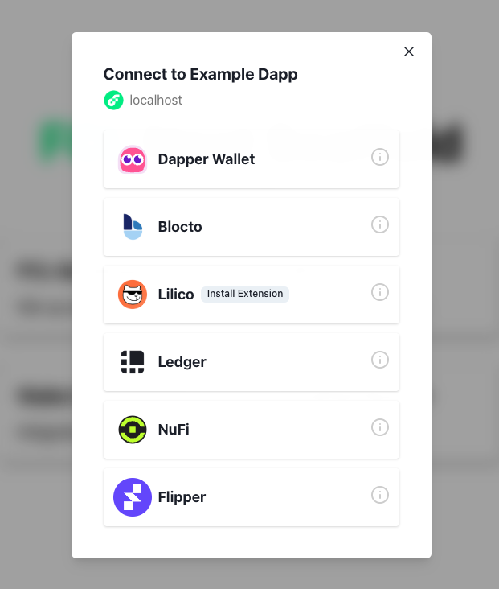

## Wallet Discovery

Knowing all the wallets available to users on a blockchain can be challenging. FCL's Discovery mechanism relieves much of the burden of integrating with Flow compatible wallets and let's developers focus on building their dapp and providing as many options as possible to their users.

There are two ways an app can use Discovery: 
 1. The **UI version** which can be configured for display via iFrame, Popup, or Tab.
 2. The **API version** which allows you to access authentication services directly in your code via `fcl.discovery.authn` method which we'll describe below.

## UI Version

When authenticating via FCL using Discovery UI, a user is shown a list of services they can use to login.



This method is the simplest way to integrate Discovery and its wallets and services into your app. All you have to do is configure `discovery.wallet` with the host endpoint for testnet or mainnet.

> **Note**: Opt-in wallets, like Ledger and Dapper Wallet, require you to explicitly state you'd like to use them. For more information on including opt-in wallets, (see these docs)[./api.md#more-configuration]. 
> 
> A [Dapper Wallet](https://meetdapper.com/developers) developer account is required. To enable Dapper Wallet inside FCL, you need to [follow this guide](https://docs.meetdapper.com/get-started).

```javascript
import { config } from "@onflow/fcl";

config({
  "accessNode.api": "https://rest-testnet.onflow.org",
  "discovery.wallet": "https://fcl-discovery.onflow.org/testnet/authn"
})
```

Any time you call `fcl.authenticate` the user will be presented with that screen.

To change the default view from iFrame to popup or tab set `discovery.wallet.method` to `POP/RPC` (opens as a popup) or `TAB/RPC` (opens in a new tab). More info about service methods can be [found here](https://github.com/onflow/fcl-js/blob/9bce741d3b32fde18b07084b62ea15f9bbdb85bc/packages/fcl/src/wallet-provider-spec/draft-v3.md).

### Branding Discovery UI

Starting in version 0.0.79-alpha.4, dapps now have the ability to display app a title and app icon in the Discovery UI by setting a few values in their FCL app config. This branding provides users with messaging that has clear intent before authenticating to add a layer of trust.

All you have to do is set `app.detail.icon` and `app.detail.title` like this:

```javascript
import { config } from "@onflow/fcl";

config({
  "app.detail.icon": "https://placekitten.com/g/200/200",
  "app.detail.title": "Kitten Dapp"
})
```

**Note:** If these configuration options aren't set, Dapps using the Discovery API will still display a default icon and "Unknown App" as the title when attempting to authorize a user who is not logged in. It is highly recommended to set these values accurately before going live.

## API Version

If you want more control over your authentication UI, the Discovery API is also simple to use as it exposes Discovery directly in your code via `fcl`.

Setup still requires configuration of the Discovery endpoint, but when using the API it is set via `discovery.authn.endpoint` as shown below.

```javascript
import { config } from "@onflow/fcl"

config({
  "accessNode.api": "https://rest-testnet.onflow.org",
  "discovery.authn.endpoint": "https://fcl-discovery.onflow.org/api/testnet/authn"
})
```

You can access services in your Dapp from `fcl.discovery`:

```javascript
import * as fcl from "@onflow/fcl"

fcl.discovery.authn.subscribe(callback)

// OR 

fcl.discovery.authn.snapshot()
```
In order to authenticate with a service (for example, when a user click's "login"), pass the selected service to the `fcl.authenticate` method described here [in the API reference](./api.md#authenticate):

```jsx
fcl.authenticate({ service })
```

A simple React component may end up looking like this:

```jsx
import "./config"
import { useState, useEffect } from "react"
import * as fcl from "@onflow/fcl"

function Component() {
  const [services, setServices] = useState([])
  useEffect(() => fcl.discovery.authn.subscribe(res => setServices(res.results)), [])

  return (
    <div>
      {services.map(service => <button key={service.provider.address} onClick={() => fcl.authenticate({ service })}>Login with {service.provider.name}</button>)}
    </div>
  )
}
```

Helpful fields for your UI can be found in the `provider` object inside of the service. Fields include the following:

```json
{
  ...,
  "provider": {
    "address": "0xf086a545ce3c552d",
      "name": "Blocto",
      "icon": "/images/blocto.png",
      "description": "Your entrance to the blockchain world.",
      "color": "#afd8f7",
      "supportEmail": "support@blocto.app",
      "authn_endpoint": "https://flow-wallet-testnet.blocto.app/authn",
      "website": "https://blocto.portto.io"
    }
}
```

## Network Configuration

### Discovery UI URLs

| Environment | Example                                          |
| ----------- | ------------------------------------------------ |
| Mainnet     | `https://fcl-discovery.onflow.org/authn`         |
| Testnet     | `https://fcl-discovery.onflow.org/testnet/authn` |
| Local       | `https://fcl-discovery.onflow.org/local/authn`   |

### Discovery API Endpoints

| Environment | Example                                              |
| ----------- | ---------------------------------------------------- |
| Mainnet     | `https://fcl-discovery.onflow.org/api/authn`         |
| Testnet     | `https://fcl-discovery.onflow.org/api/testnet/authn` |
| Local       | `https://fcl-discovery.onflow.org/api/local/authn`   |

> Note: Local will return [Dev Wallet](https://github.com/onflow/fcl-dev-wallet) on emulator for developing locally with the default port of 8701. If you'd like to override the default port add ?port=0000 with the port being whatever you'd like to override it to.

## Other Configuration

> Note: Configuration works across both UI and API versions of Discovery.

### Include Opt-In Wallets

**Starting in FCL v0.0.78-alpha.10**

Opt-in wallets are those that don't have support for authentication, authorization, and user signature services. Or, support only a limited set of transactions.

To include opt-in wallets from FCL:

```
import * as fcl from "@onflow/fcl"

fcl.config({
  "discovery.wallet": "https://fcl-discovery.onflow.org/testnet/authn",
  "discovery.authn.endpoint": "https://fcl-discovery.onflow.org/api/testnet/authn",
  "discovery.authn.include": ["0x123"] // Service account address
})
```

**Opt-In Wallet Addresses on Testnet and Mainnet**

| Service         | Testnet            | Mainnet            |
| --------------- | ------------------ | ------------------ |
| `Dapper Wallet` | 0x82ec283f88a62e65 | 0xead892083b3e2c6c |
| `Ledger`        | 0x9d2e44203cb13051 | 0xe5cd26afebe62781 |

To learn more about other possible configurations, check out the following links:
- [Discovery API Docs](./api.md#discovery)
- [Discovery Github Repo](https://github.com/onflow/fcl-discovery)