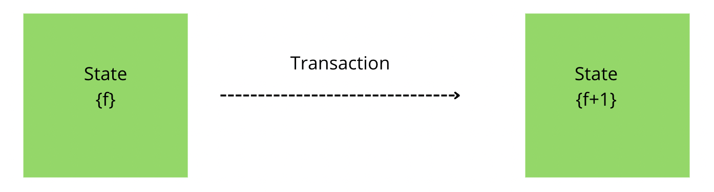
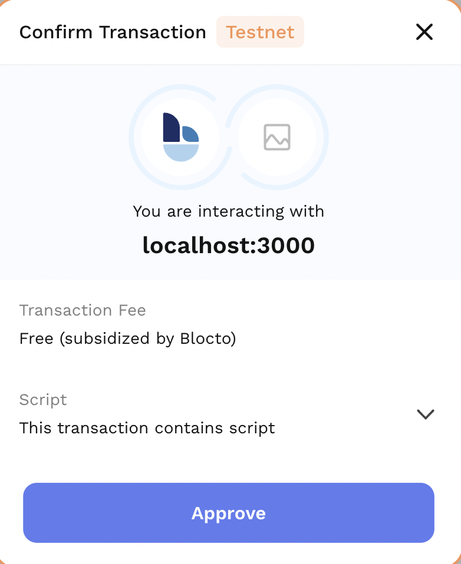

# Transactions
A transaction is a code submitted to the blockchain that changes the state of one or more user accounts and smart contracts. 
The simplest transaction is transferring Flow from one account to another.
For example, if Cindy sends Jenny 1 Flow, Jenny's account will be credited. This changing state action takes place within a transaction.

## Prerequisites
We recommend you read [Accounts](https://developers.flow.com/cadence/language/accounts) and [Scripts](https://developers.flow.com/tools/fcl-js/reference/scripts) to better understand this page.

All transactions derive from at least one user account. In most cases, a transaction passes data between a user account and a smart contract.
This state change is broadcasted to all nodes in the network. Some examples of transactions:
- Send X Flow from my account to John's account.
- Submit the Cadence code into the blockchain state.



Transactions that change the Flow blockchain state will be broadcast to the whole network, and any node can request to broadcast a transaction to be executed on the blockchain. Then after this happens, a node operator will execute the transaction and spread the state changes to the whole network.   
Also, transactions require a fee to execute. The flat [fee](https://developers.flow.com/flow/faq/developers) of **0.00001 FLOW** is applied to every transaction submitted to the network. 



A submitted transaction includes the following information: 
- **Cadence** – The smart contracts on the Flow Blockchain or Cadence contracts are deployed to the account.
- **Proposer** – The proposer is an account that proposes a transaction. Sometimes, proposers differ from the account owner and the transaction signer.
- **Payer** – is an account that is paying for the transaction fees.
- **Limit** – the maximum amount of gas units that the transaction can consume. Units of gas represent computational steps.

It's important you understand how a transaction is signed on the Flow network. To learn more, click [here](https://developers.flow.com/learn/concepts/transaction-signing)

## Transaction Statuses 
Once you submit the transaction, the status of your transaction will change from 0-5, as explained below.
- The status changes to `0`, meaning the transaction status is unknown.
- Next, the status changes to `1`, meaning the transaction has been received by a collector but not yet finalized in a block.
- Next, the status changes to `2`, meaning the consensus nodes have finalized the block in which the transaction is included.
- Next, the status changes to `3`, meaning the execution nodes have produced a result for the transaction.
- Next, the status changes to `4`, meaning the verification nodes have verified the transaction (the block in which the transaction is), and the seal is included in the latest block.
- Then if the status changes to `5`, meaning the transaction was submitted past its expiration block height. 

## Types of transactions
On Flow, there are a few different types of transactions:
- **Account transactions:** A transaction from one account to another.
- **Cadence transactions:** A transaction initiated by the Cadence code.

## Sending your first Transaction

First, it sends a transaction to the Flow blockchain. For this transaction, the current user authorizes it as both the proposer and the payer. Something unique to Flow is that the one paying for the transaction doesn't always need to be the one performing the transaction. 

Proposers and Payers are special authorizations that are always required for a transaction. The proposer acts similar to the nonce in Ethereum transactions and helps prevent repeat attacks. The payer is who will be paying for the transaction. If these are not set, FCL defaults to using the current user for all roles.

fcl.mutate is a [JavaScript Tagged Template Literal](https://styled-components.com/docs/advanced#tagged-template-literals) that will return a transactionId. We can pass the response directly to fcl.tx and then use the onceSealed method, which resolves a promise when the transaction is sealed.

`fcl.mutate` will return a `transactionId`. We can pass the response directly to `fcl.tx` and then use the `onceSealed` method which resolves a promise when the transaction is sealed.

```javascript
import * as fcl from "@onflow/fcl"

const transactionId = await fcl.mutate({
  cadence: `
    transaction {
      execute {
        log("Hello from execute")
      }
    }
  `,
  proposer: fcl.currentUser,
  payer: fcl.currentUser,
  limit: 50
})

const transaction = await fcl.tx(transactionId).onceSealed()
console.log(transaction) // The transactions status and events after being sealed
```

## Authorizing a transaction

The below code snippet is the same as the above one, except for one significant difference. Our Cadence code has a prepared statement this time, and we are using the fcl.currentUser when constructing our transaction.

The `prepare` statement's arguments directly map to the `authorizations` order in the array. So four authorizations mean four `AuthAccounts` as arguments passed to `prepare`. In this case, though, there is only one, the `currentUser`.

These authorizations are important as you can only access/modify an account's storage if you have the authorization of the said account.

```javascript
import * as fcl from "@onflow/fcl"

const transactionId = await fcl.mutate({
  cadence: `
    transaction {
      prepare(acct: AuthAccount) {
        log("Hello from prepare")
      }
      execute {
        log("Hello from execute")
      }
    }
  `,
  proposer: fcl.currentUser,
  payer: fcl.currentUser,
  authorizations: [fcl.currentUser],
  limit: 50
})

const transaction = await fcl.tx(transactionId).onceSealed()
console.log(transaction) // The transactions status and events after being sealed
```

To learn more about `mutate`, check out the [API documentation](./api/#mutate).
