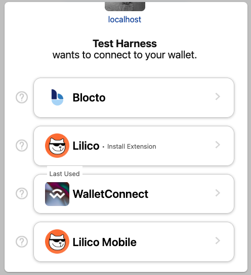

# Add FCL Support for WalletConnect 2.0

To improve developer experience and streamline **Flow** dApp integration with **WalletConnect 2.0** wallets, **FCL `^1.3.0`** introduces support for **`discovery-service`** plugins. These **`ServicePlugins`** allow for injection of client configured **services**, service **methods**, and the execution **strategies** required to interact with them.
FCL dApps can opt-in through use of the [**fcl-wc**](https://www.npmjs.com/package/@onflow/fcl-wc) package and **FCL Plugin Registry**.

When using FCL Discovery for authentication, dApps are able to support most FCL-compatible wallets and their users on Flow without any custom integrations or changes needed to the dApp code. 

These instructions explain how dApps can also add support for FCL compatible wallets that use the WalletConnect 2.0 protocol.

## How does it work?

- The **`fc-wc`** package is used to initialize a **WalletConnect 2.0** [**`SignClient`**](https://docs.walletconnect.com/2.0/introduction/sign) instance, and build a **`discovery-service`** **`ServicePlugin`** based on dApp specified options.
- **`discovery-service`** plugins are used to add opt-in wallets and other services to **FCL Wallet Discovery** (UI/API).
- The **FCL Plugin Registry** offers dApps the ability to add new services, methods, and the execution strategies needed to interact with them.

### Requirements

- `fcl` version >= `1.3.0`
- `fcl-wc` version >= `1.0.0`

### Implementation path

|     |    |    |
| :-: | :- | :- |
| [**1**](#1-add-required-packages) | Add required packages | Install and import minimum `fcl` and `fcl-wc` [versions](#requirements)|
| [**2**](#2-obtain-a-walletconnect-projectid) | Obtain a WalletConnect `projectID` | Visit [WalletConnect Cloud Registry](https://cloud.walletconnect.com/) and register for public relay server access and an application `projectId` |
| [**3**](#3-initialize-walletconnect-signclient-and-fclwcserviceplugin) | Initialize WalletConnect `SignClient` and `FclWcServicePlugin` | Initialize WalletConnect `SignClient` and `FclWcServicePlugin` with [configuration options](#configuration-options) |
| [**4**](#4-add-fclwcserviceplugin-to-fcl-plugin-registry) | Add `FclWcServicePlugin` to FCL Plugin Registry | Inject `FclWcServicePlugin` via `fcl.pluginRegistry.add(FclWcServicePlugin)` |

### 1. Add required packages

Install the `fcl` and `fcl-wc` packages:

```bash
npm install @onflow/fcl@ @onflow/fcl-wc
```

### 2. Obtain a WalletConnect projectID

Visit [WalletConnect Cloud Registry](https://cloud.walletconnect.com/) and register for public relay server access and an application **`projectId`**.

### 3. Initialize WalletConnect `SignClient` and `FclWcServicePlugin`

In addition to the WalletConnect `SignClient`, the `init` method of `fcl-wc` returns a [`ServicePlugin`](#serviceplugin-spec) object. This object can be injected using the [FCL Plugin Registry](#pluginregistry) to add support for new service methods and their corresponding execution strategies (like `WC/RPC` for WalletConnect ).
A `discovery-service` `ServicePlugin` may also include additional opt-in wallets to offer your users through FCL Wallet Discovery.

#### Configuration options

Initialize WalletConnect `SignClient` and `FclWcServicePlugin` with the following configuration options:

| Name       | Type    | Default | Description                                                                    |
| ---------- | ------- | ------- | ------------------------------------------------------------------------------ |
| `projectId` | boolean **(required)** | null   | A WalletConnect projectId for public relay server access. Your Project ID can be obtained from [WalletConnect Cloud Dashboard](https://cloud.walletconnect.com/app)  |
| `metadata` | object | { }  | Optional dApp metadata to describe your application and define its appearance in a web browser. More details can be found [here](https://docs.walletconnect.com/2.0/swift/sign/dapp-usage) |
| `includeBaseWC` | boolean | false   | Optional configuration to include a generic WalletConnect service in FCL Discovery (UI/API). <br /> :exclamation: BaseWC Service offers no deeplink support for mobile. |
| `wcRequestHook` | function | null  | Optional function is called on all desktop WalletConnect client session proposals and signing requests. Use this to handle alerting user to check wallet for approval. |
| `pairingModalOverride` | function | null  | Optional function called to allow override of included QRCodeModal. Function receives two arguments: <br> 1. Connection `uri` to display QR code or send to wallet to create pairing. <br> 2. Callback function to manually cancel the request. |
| `wallets` | array | [ ] | Optional list of WalletConnect `authn` services to include in FCL Wallet Discovery (UI/API). <br /> :exclamation: Only available for use on **`testnet`**. These services will be combined with wallets returned from [WalletConnect cloud registry API](https://cloud.walletconnect.com/) and sent to Discovery for display in UI and inclusion in API response. |

#### Returns

|  Name  |  Type  |  Description  |
| ----- | ------- | ---------- |
| [FclWcServicePlugin](#fclwcserviceplugin) | `ServicePlugin` | A `ServicePlugin` of type `discovery-service`.  May also include optional `authn` services to offer through FCL Wallet Discovery (UI/API). |
| [client](#) | `SignClient` | An initialized WalletConnect [`SignClient`](https://docs.walletconnect.com/2.0/introduction/sign). |

```js
const FclWcServicePlugin = {
  name: "fcl-plugin-service-walletconnect",
  f_type: "ServicePlugin",   // the type of FCL plugin
  type: "discovery-service", // the is a service sent to Discovery
  services: [Service],       // (optional) Generic, Cloud Registry and client injected WalletConnect services
  serviceStrategy: {method: "WC/RPC", exec: execStrategy, // the method name and execution strategy for WalletConnect services
}
```

:exclamation: Setting FCL config `flow.network` to **`testnet`** or **`mainnet`** is required to use `fcl-wc` as it enables `"WC/RPC"` service strategy to request correct chain permissions.

```
import {config} from '@onflow/config'

config({
    "flow.network": "mainnet"
})
```

See [FCL Configuration](https://developers.flow.com/tools/fcl-js/reference/configure-fcl) for more information.


### 4. Add FclWcServicePlugin to FCL Plugin Registry

In addition to the WalletConnect `SignClient`, the `init` method of `fcl-wc` returns a [`ServicePlugin`](#serviceplugin-spec) object. This object can be injected into the FCL Plugin Registry to add FCL support for new service methods, (like WC/RPC for WalletConnect) and their corresponding execution strategies.

#### Usage

```js
import * as fcl from "@onflow/fcl"
import { init } from "fcl-wc"

const { FclWcServicePlugin, client } = await init({
  projectId: WC_PROJECT_ID, // required
  metadata: WC_APP_METADATA, // optional
  includeBaseWC: false, // optional, default: false
  wallets: [], // optional, default: []
  wcRequestHook: (wcRequestData) => { // optional,default: null
    handlePendingRequest(data)
  },
  pairingModalOverride: (uri, rejectPairingRequest) => { // optional,default: null
    handlePendingPairingRequest(data)
  }
})

fcl.pluginRegistry.add(FclWcServicePlugin)
```

---

### ServicePlugin Spec


| Key         | Value Type | Description                   |
| ----------- | ---------- | ----------------------------- |
| `name`        | string     | The name of the plugin.         |
| `f_type`  | string     | The type of plugin (currently only supports `ServicePlugin` type). |
| `type`    | string     | The plugin subtype (currently only supports `discovery-service` type). |
| `services` | array     | A list of services to add to FCL. |
| `serviceStrategy` | { method: string, exec: function }     | The method and corresponding strategy FCL uses to interact with the service. A service with the `service.method` property set to `"WC/RPC"` tells FCL to use the corresponding service strategy if it is supported by the dApp. |

---

## Integrating With Wallet Discovery

Knowing all the wallets available to users on a blockchain can be challenging. FCL's Discovery mechanism relieves much of the burden of integrating with Flow compatible wallets and let's developers focus on building their dApp and providing as many options as possible to their users.

There are two ways an app can use [Wallet Discovery](https://github.com/onflow/fcl-js/blob/master/docs/reference/discovery.mdx):

1. The UI version which can be configured for display via iFrame, Popup, or Tab.

2. The API version which allows you to access authentication services directly in your code via `fcl.discovery.authn` method which we'll describe below.

When using FCL Wallet Discovery for authentication, dApps are able to support FCL-compatible wallets on Flow without any custom integrations or changes needed to the dApp code.

#### `discovery-service` ServicePlugin

`FclWcServicePlugin` is a `ServicePlugin` of type `discovery-service`. `discovery-service` plugins may include additional authentication services to offer through FCL Wallet Discovery.

Once a valid `discovery-service` plugin is registered, FCL shares client supported services with Discovery to add registered and injected wallets to the UI and API. 

To connect a Flow supported wallet using WalletConnect 2.0, users of your dApp will go through the authentication process and have the option to select their preferred wallet.

:exclamation: Once a WalletConnect session is established and a `currentUser` is authenticated, FCL will handle client pairings and sessions during FCL `authn`, and initiate signing requests as part of `authz` using `fcl.mutate` and [`user-sign`](https://github.com/onflow/fcl-js/blob/master/docs/reference/user-signatures.mdx) using `fcl.signUserMessage`.

### How to add your FCL compatible WalletConnect wallet to Discovery (UI/API)

1. [Submit a PR](https://github.com/onflow/fcl-discovery/blob/master/data/services.json) to add your wallet to FCL Wallet Discovery `services.json`
2. Submit your FCL compatible wallet to [WalletConnect Cloud Registry](https://cloud.walletconnect.com/)
3. Add Wallet Service to `fcl-wc` init options. :exclamation: testnet only.

FCL tells Wallet Discovery which services are supported by the client (installed extensions and `discovery-service` `ServicePlugins`) so only those supported will be shown in Discovery UI or returned via Discovery API.



## Wallet Provider Spec

### Implementation path

|     |    |    |
| :-: | :- | :- |
| **1** | Obtain a WalletConnect `projectId` |  Register to receive a `projectId` from the [WalletConnect Cloud Registry](https://cloud.walletconnect.com/). |
| **2** | Conform to [FCL Wallet Provider Spec](https://github.com/onflow/fcl-js/blob/master/packages/fcl/src/wallet-provider-spec/draft-v4.md) | Compatible wallets must support `flow_authn`, `flow_authz`, and `flow_user_sign` methods and wrap data in the appropriate FCL Response type. Services returned with the `AuthnResponse` of `flow_authn` should set `service.endpoint` to corresponding methods.<br> **ServiceType** `authz` : `flow_authz` <br> **ServiceType** `user-signature` : `flow_user_sign`
| **3** | Add wallet to WalletConnect Cloud Registry API **(optional)** | Submit your wallet to be included in the [WalletConnect Cloud Registry API and Explorer](https://explorer.walletconnect.com/) |
| **4** | Responses | All responses need to be wrapped in a [`PollingResponse`](https://github.com/onflow/fcl-js/blob/master/packages/fcl/src/wallet-provider-spec/draft-v4.md#pollingresponse) |

#### Metadata requirements

:exclamation: In order to correctly identify, improve pairing, and include deep link support for mobile, services using the `WC/RPC` method need to use the same universal link as their `uid` and `url` in Wallet metadata.
Wallets sourced from WalletConnect Cloud Registry automatically build the service from data and will set the `service.uid` to the universal link.

```javascript

import SignClient from '@walletconnect/sign-client'

export let signClient: SignClient

export async function createSignClient() {
  signClient = await SignClient.init({
    projectId: PROJECT_ID,
    relayUrl: 'wss://relay.walletconnect.com',
    metadata: {
      name: 'Awesome Wallet',
      description: 'Awesome Wallet with FCL Support for WalletConnect',
      url: 'https://deeplink.awesome-wallet.com/',
      icons: ['https://avatars.githubusercontent.com/u/37784886']
    }
  })
}

````

## Next steps

1. Read the [FCL Wallet Provider Spec](https://github.com/onflow/fcl-js/blob/master/packages/fcl/src/wallet-provider-spec/draft-v4.md).
2. Check out the a WalletConnect 2.0 [React POC Wallet](https://github.com/gregsantos/flow-walletconnect-v2-react-wallet) and [FCL Flow dApp](https://github.com/gregsantos/flow-walletconnect-v2-react-dapp) with support for WalletConnect v2.0.
3. Read and review the [WalletConnect 2.0 Docs](https://docs.walletconnect.com/2.0/), [examples and resources](https://docs.walletconnect.com/2.0/introduction/examples-and-resources).
