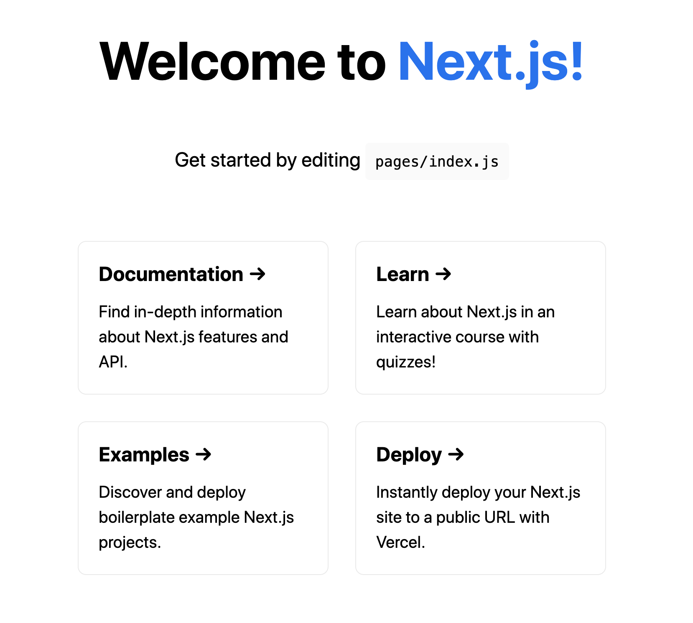
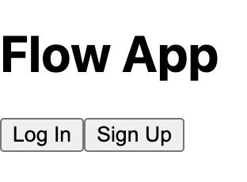

# Flow App Quickstart

---

**Last Updated:** June 15th 2022

> **Note**: This page will walk you through a very bare bones project to get started building a web3 dapp using the Flow Client Library (FCL). If you are looking for a clonable repo, Flow community members have created quickstart templates for different JavaScript frameworks (e.g. [Next.js](https://github.com/muttoni/fcl-nextjs-quickstart), [SvelteKit](https://github.com/muttoni/fcl-sveltekit-quickstart), [Nuxt](https://github.com/bluesign/nuxt3-fcl)). You can consult the complete list [here](https://github.com/ph0ph0/Get-The-Flow-Down#fcl).


## Introduction

FCL (Flow Client Library) is the easiest way to build decentralized applications. FCL wraps much of the logic you would have to write on other blockchains. Follow this quick start, and you will have an overview of building a shippable dapp on Flow.
We're going to assume that you know or understand React. However, the concepts should be easily understood and transferred to another framework.

In this tutorial, you will learn how to do the following FCL concepts below:
- [Installation](#installation)
- [Configuration](#configuration)
- [Authentication](#authentication)

Moreover, we are always happy to help on [Discord](https://discord.gg/2KY4G5Myq7) if you have any questions. Finally, there are links at the end of this article for diving deeper into building on Flow.


## Installation

The first step is to generate a React app using Next.js and [create-next-app](https://nextjs.org/docs/api-reference/create-next-app). Then, from your terminal, run the following:

```sh
npx create-next-app@latest flow-app

```
Next,locate the flow-app folder.
```
cd flow-app

```

Then, install FCL so we can use it in our app.

```sh
npm install @onflow/fcl --save
```

Now run the app using the following command in your terminal.

```sh
npm run dev
```

The above command will return an output similar to the following on your terminal.

```sh
ready - started server on 0.0.0.0:3000, url: http://localhost:3000
wait  - compiling...
event - compiled client and server successfully in 362 ms (125 modules)

```

when you enter `http://localhost:3000`on your browser, you will get a similar output.



## Configuration

Now that your app is running, you can configure FCL. Within the main project directory, create a folder called `flow` and a file called `config.js`. This file will contain the configuration information for FCL, such as the Access Node and wallet discovery endpoint (e.g. testnet or a local emulator). 

Add the following contents to the `config.js` file

> **Create file:** `./flow/config.js`

```javascript
import { config } from "@onflow/fcl";

config({
  "accessNode.api": "https://rest-testnet.onflow.org", // Mainnet: "https://rest-mainnet.onflow.org"
  "discovery.wallet": "https://fcl-discovery.onflow.org/testnet/authn" // Mainnet: "https://fcl-discovery.onflow.org/authn"
})
```

The folder structure should look similar to the image below.


📣 **Tip**: It is recommended to replace these values with environment variables for easy deployments across different environments like development/production or Testnet/Mainnet.

- The `accessNode.api` key specifies the address of a Flow access node. Flow provides these, but in the future access to Flow may be provided by other 3rd parties, through their access nodes. 
- The `discovery.wallet` is an address pointing to a service that lists FCL-compatible wallets. Flow's FCL Discovery service is a service that FCL wallet providers can be added to and be made 'discoverable' to any application that uses the discovery.wallet endpoint.

> Learn more about [configuring Discovery](../reference/discovery) or [setting configuration values](../reference/api.md#setting-configuration-values).

The main page for Next.js apps is located in `pages/index.js`. So you can finish configuring our dapp by going into the `pages/` folder and importing the config file into the top of our `index.js` file. You will import the config file in the default component in `index.js`.

> **Replace file:** `./pages/index.js`

```jsx

import "../flow/config";

```

Now you are ready to start talking to Flow!

## Authentication

In this section, you will learn how to add sign-up and sign-in functionality in your Flow dapp.
To authenticate a user, you will call `fcl.logIn()`, if the user is authenticated, FCL sets an object called `fcl.currentUser`, which exposes methods for watching changes in user data, signing transactions, and more. For more information on the `currentUser`, read more [here](../reference/api.md#current-user).

For the sake of this tutorial, you will add a few buttons for sign up/log in and subscribe to changes on the `currentUser`. When the user is updated (which it will be after authentication), you will set the user state in your component to reflect this. To demonstrate user authenticated sessions, you will conditionally render a component based on if the user is or is not logged in.

This is what your file should look like now:

> **Replace file:** `./pages/index.js`

```jsx
import Head from 'next/head'
import "../flow/config";
import { useState, useEffect } from "react";
import * as fcl from "@onflow/fcl";

export default function Home() {

  const [user, setUser] = useState({loggedIn: null})

  useEffect(() => fcl.currentUser.subscribe(setUser), [])

  const AuthedState = () => {
    return (
      <div>
        <div>Address: {user?.addr ?? "No Address"}</div>
        <button onClick={fcl.unauthenticate}>Log Out</button>
      </div>
    )
  }

  const UnauthenticatedState = () => {
    return (
      <div>
        <button onClick={fcl.logIn}>Log In</button>
        <button onClick={fcl.signUp}>Sign Up</button>
      </div>
    )
  }

  return (
    <div>
      <Head>
        <title>FCL Quickstart with NextJS</title>
        <meta name="description" content="My first web3 app on Flow!" />
        <link rel="icon" href="/favicon.png" />
      </Head>
      <h1>Flow App</h1>
      {user.loggedIn
        ? <AuthedState />
        : <UnauthenticatedState />
      }
    </div>
  );
}

```

You should now be able to log in or sign up a user and unauthenticate them. Upon logging in or signing up, your users will see a popup where they can choose between wallet providers. You will select the [Blocto wallet](https://blocto.portto.io/) for this example to create an account. Upon completing authentication, you will see the component change, and the user's wallet address appears on the screen. You should see a similar image below if you have completed this properly.



We recommend you follow up with this tutorial [Flow web3 app](../tutorials/flow-web3-app.mdx) to learn how to Query the blockchain, Initialize an account, Mutate a blockchain.

There is so much more to know. We have a lot more resources to help you build. To dive deeper, here are a few good places for taking the next steps:


**Cadence**
- [Cadence Playground Tutorials](https://docs.onflow.org/cadence/tutorial/01-first-steps/)
- [Cadence Hello World Video](https://www.youtube.com/watch?v=pRz7EzrWchs)
- [Why Cadence?](https://www.onflow.org/post/flow-blockchain-cadence-programming-language-resources-assets)

**Full Stack NFT Marketplace Example**
- [Beginner Example: CryptoDappy](https://github.com/bebner/crypto-dappy)
- [Advanced Example: Kitty Items](https://github.com/onflow/kitty-items)

**More FCL**
- [FCL API Quick Reference](../reference/api.md)
- [More on Scripts](../reference/scripts.mdx)
- [More on Transactions](../reference/transactions.mdx)
- [User Signatures](../reference/user-signatures.mdx)
- [Proving Account Ownership](../reference/proving-authentication.mdx)

**Other**
- [Flow Developer Onboarding Guide](https://docs.onflow.org/dapp-development/)
