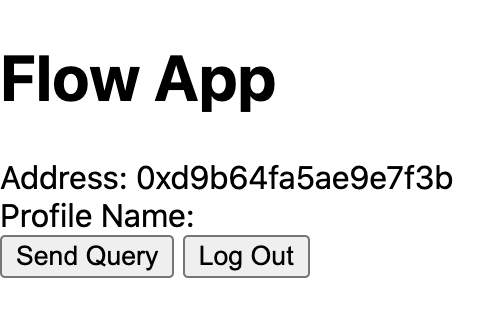
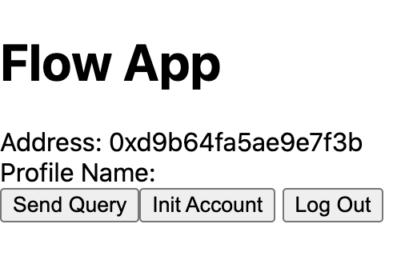

> **Note**: This page will walk you through a very bare bones project to get started building a web3 dapp using the Flow Client Library (FCL). If you are looking for a clonable repo, Flow community members have created quickstart templates for different JavaScript frameworks (e.g. [Next.js](https://github.com/muttoni/fcl-nextjs-quickstart), [SvelteKit](https://github.com/muttoni/fcl-sveltekit-quickstart), [Nuxt](https://github.com/bluesign/nuxt3-fcl)). You can consult the complete list [here](https://github.com/ph0ph0/Get-The-Flow-Down#fcl).

## Video Walkthrough

Below is a video walkthrough covering the contents of this tutorial. You are welcome to watch or skip the video walkthrough depending on your style of learning.

<iframe width="560" height="315" src="https://www.youtube.com/embed/uEoh9SnjqCk" title="YouTube video player" frameborder="0" allow="accelerometer; autoplay; clipboard-write; encrypted-media; gyroscope; picture-in-picture" allowfullscreen></iframe>


In this tutorial, you will learn how to interact with an existing smart contract on Flow's testnet, the Profile Contract. Using this contract, you will create a new profile and edit the profile information, both via a wallet.

## Prerequisite
- Completed the Flow quick start guide
- Basic understanding of Cadence programming language

## Querying the Blockchain

One of the main things you'll often need to do when building a dapp is query the Flow blockchain and the smart contracts deployed for data. 
Since smart contracts will live on both Testnet and Mainnet, you will put the account address where the smart contract lives into the configuration (remember, 
it's recommended that you change this later to use environment variables). You will give it a key of `Profile` and prefix it with `0x` so that the final key is `0xProfile`. 
The prefix is important because it tells FCL to pull the corresponding addresses needed from the configuration value.

> **Replace file:** `./flow/config.js`

```javascript
import { config } from "@onflow/fcl";

config({
 "accessNode.api": "https://rest-testnet.onflow.org", // Mainnet: "https://rest-mainnet.onflow.org"
  "discovery.wallet": "https://fcl-discovery.onflow.org/testnet/authn", // Mainnet: "https://fcl-discovery.onflow.org/authn"
  "0xProfile": "0xba1132bc08f82fe2" // The account address where the Profile smart contract lives on Testnet
})
```
**First, you will query the contract to see the user's profile name.**
A few things need to happen to do that:
1. You need to import the contract and pass it to the user's account address as an argument.
2. Execute the script using fcl.query.
3. Set the result of the script to the app state in React so we can display the profile name in our browser.
4. Display "No Profile" if one was not found.

Take a look at the new code. We'll explain each new piece as we go. Remember, the cadence code is a separate language from JavaScript used to write smart contracts, 
so you don't need to spend too much time trying to understand it. (Of course, you're more than welcome to, if you want to!)

> **Replace file:** `./pages/index.js`

```jsx
import Head from 'next/head'
import "../flow/config";
import { useState, useEffect } from "react";
import * as fcl from "@onflow/fcl";

export default function Home() {

  const [user, setUser] = useState({loggedIn: null})
  const [name, setName] = useState('') // NEW

  useEffect(() => fcl.currentUser.subscribe(setUser), [])

	// NEW
  const sendQuery = async () => {
    const profile = await fcl.query({
      cadence: `
        import Profile from 0xProfile

        pub fun main(address: Address): Profile.ReadOnly? {
          return Profile.read(address)
        }
      `,
      args: (arg, t) => [arg(user.addr, t.Address)]
    })

    setName(profile?.name ?? 'No Profile')
  }

  const AuthedState = () => {
    return (
      <div>
        <div>Address: {user?.addr ?? "No Address"}</div>
        <div>Profile Name: {name ?? "--"}</div> {/* NEW */}
        <button onClick={sendQuery}>Send Query</button> {/* NEW */}
        <button onClick={fcl.unauthenticate}>Log Out</button>
      </div>
    )
  }

  const UnauthenticatedState = () => {
    return (
      <div>
        <button onClick={fcl.logIn}>Log In</button>
        <button onClick={fcl.signUp}>Sign Up</button>
      </div>
    )
  }

  return (
    <div>
      <Head>
        <title>FCL Quickstart with NextJS</title>
        <meta name="description" content="My first web3 app on Flow!" />
        <link rel="icon" href="/favicon.png" />
      </Head>
      <h1>Flow App</h1>
      {user.loggedIn
        ? <AuthedState />
        : <UnauthenticatedState />
      }
    </div>
  );
}

```

In the `AuthedState` component, you added a button to send a query for the user's profile name and a div to display the result above it. 
The corresponding `useState` initialization can be seen at the top of the component.
The other thing you did was build out the query inside the `sendQuery` method. So take a look at it more closely:

```javascript
await fcl.query({
  cadence: `
    import Profile from 0xProfile

    pub fun main(address: Address): Profile.ReadOnly? {
      return Profile.read(address)
    }
  `,
  args: (arg, t) => [arg(user.addr, t.Address)]
});
```

Cadence is Flow's smart contract language we mentioned. When you look at this tutorial, you notice that it's importing the `Profile` contract from the account you named `0xProfile` earlier in our config file, then also taking an account address and reading it. 

In the `args` section, you pass your user's account address from the user you set in state after authentication and give it a type of Address. For more possible types,  [see this reference](../reference/api.md#ftype).
Go ahead and click the "Send Query" button. You should see "No Profile." That's because you haven't initialized the account yet.



## Initializing the Account
For the Profile contract to store a Profile in a user's account, it does so by initializing what is called a `resource`. 
A resource is an ownable piece of data and functionality that can live in the user's account storage. 
This paradigm is known as "resource-oriented programming", a principle that is core to Cadence and differentiates its ownership model from other smart contract languages, [read more here](https://docs.onflow.org/cadence/#intuiting-ownership-with-resources). Cadence makes it so that resources can only exist in one place at any time. They must be deliberately created, cannot be copied, and, if desired, be intentionally destroyed.

> There's much more to resources in Cadence than we'll cover in this guide, so if you'd like to know more, check out [this Cadence intro](https://docs.onflow.org/cadence/).

To do this resource initialization on an account, you will add another function called initAccount. 
Then, inside that function, add some Cadence code that says, **"Hey, does this account have a profile? If it doesn't, let's add one."** a `transaction` is responsible for doing that.
Transactions occur when you want to change the state of the blockchain, in this case, some data in a resource, in a specific account. And there is a cost (transaction fee) to do that, unlike a query.

Instead of `query`, you will use `mutate` for transactions. And because there is a cost, you need to add a few fields that tell Flow who is proposing the transaction, 
who is authorizing it, who is paying for it, and how much they're willing to pay. Those fields — not surprisingly — are called: `proposer`, `authorizer`, `payer`, and `limit`. For more information on these signatory roles, check out [this doc](https://docs.onflow.org/concepts/transaction-signing/#signer-roles).

what the account initialization function looks like:


```javascript
const initAccount = async () => {
  const transactionId = await fcl.mutate({
    cadence: `
      import Profile from 0xProfile

      transaction {
        prepare(account: AuthAccount) {
          // Only initialize the account if it hasn't already been initialized
          if (!Profile.check(account.address)) {
            // This creates and stores the profile in the user's account
            account.save(<- Profile.new(), to: Profile.privatePath)

            // This creates the public capability that lets applications read the profile's info
            account.link<&Profile.Base{Profile.Public}>(Profile.publicPath, target: Profile.privatePath)
          }
        }
      }
    `,
    payer: fcl.authz,
    proposer: fcl.authz,
    authorizations: [fcl.authz],
    limit: 50
  })

  const transaction = await fcl.tx(transactionId).onceSealed()
  console.log(transaction)
}
```

You will notice `fcl.authz`. That's shorthand for "use the current user to authorize this transaction" (you could also write it as `fcl.currentUser.authorization`). You can view the docs here to learn more about transactions and signing transactions. Again, you will keep this example simple with the user in each of these roles.
You will also notice an awaiting response with your transaction data using the syntax `fcl.tx(transactionId).onceSealed()`. This will return when the blockchain has sealed the transaction and is complete in processing and verifying it.
Now your `index.js` file should look like this (you also added a button for calling the `initAccount` function in the `AuthedState`):

> **Replace file:** `./pages/index.js`
```jsx
import Head from 'next/head'
import "../flow/config";
import { useState, useEffect } from "react";
import * as fcl from "@onflow/fcl";

export default function Home() {

  const [user, setUser] = useState({loggedIn: null})
  const [name, setName] = useState('')

  useEffect(() => fcl.currentUser.subscribe(setUser), [])

  const sendQuery = async () => {
    const profile = await fcl.query({
      cadence: `
        import Profile from 0xProfile

        pub fun main(address: Address): Profile.ReadOnly? {
          return Profile.read(address)
        }
      `,
      args: (arg, t) => [arg(user.addr, t.Address)]
    })

    setName(profile?.name ?? 'No Profile')
  }

  // NEW
  const initAccount = async () => {
    const transactionId = await fcl.mutate({
      cadence: `
        import Profile from 0xProfile

        transaction {
          prepare(account: AuthAccount) {
            // Only initialize the account if it hasn't already been initialized
            if (!Profile.check(account.address)) {
              // This creates and stores the profile in the user's account
              account.save(<- Profile.new(), to: Profile.privatePath)

              // This creates the public capability that lets applications read the profile's info
              account.link<&Profile.Base{Profile.Public}>(Profile.publicPath, target: Profile.privatePath)
            }
          }
        }
      `,
      payer: fcl.authz,
      proposer: fcl.authz,
      authorizations: [fcl.authz],
      limit: 50
    })

    const transaction = await fcl.tx(transactionId).onceSealed()
    console.log(transaction)
  }

  const AuthedState = () => {
    return (
      <div>
        <div>Address: {user?.addr ?? "No Address"}</div>
        <div>Profile Name: {name ?? "--"}</div>
        <button onClick={sendQuery}>Send Query</button>
        <button onClick={initAccount}>Init Account</button> {/* NEW */}
        <button onClick={fcl.unauthenticate}>Log Out</button>
      </div>
    )
  }

  const UnauthenticatedState = () => {
    return (
      <div>
        <button onClick={fcl.logIn}>Log In</button>
        <button onClick={fcl.signUp}>Sign Up</button>
      </div>
    )
  }

  return (
    <div>
      <Head>
        <title>FCL Quickstart with NextJS</title>
        <meta name="description" content="My first web3 app on Flow!" />
        <link rel="icon" href="/favicon.png" />
      </Head>
      <h1>Flow App</h1>
      {user.loggedIn
        ? <AuthedState />
        : <UnauthenticatedState />
      }
    </div>
  )
}

```
Click the "Init Account" button to see the wallet asking you to approve a transaction. After approving, 
you will see a transaction response appear in your console (make sure to have that open). It may take a few moments. 
With the transaction result printed, you can use the `transactionId` to look up the transaction details using a [block explorer](https://testnet.flowscan.org).



## Mutating the Blockchain
Once the profile is initialized, you will want to mutate it more. In this example, you will use the same smart contract provided to change the profile name.

To do that, you will write another transaction that adds some Cadence code that lets you set the name. Everything else looks the same in the following code except for one thing: you will subscribe to the status changes instead of waiting for it to be sealed after the mutate function returns.
It looks like this:

```javascript
const executeTransaction = async () => {
  const transactionId = await fcl.mutate({
    cadence: `
      import Profile from 0xProfile

      transaction(name: String) {
        prepare(account: AuthAccount) {
          account
            .borrow<&Profile.Base{Profile.Owner}>(from: Profile.privatePath)!
            .setName(name)
        }
      }
    `,
    args: (arg, t) => [arg("Flow Developer", t.String)],
    payer: fcl.authz,
    proposer: fcl.authz,
    authorizations: [fcl.authz],
    limit: 50
  })

  fcl.tx(transactionId).subscribe(res => setTransactionStatus(res.status))
}
```

Here you can see our argument is **Flow Developer**; at the bottom, you have called the `subscribe` method instead of `onceSealed`.
To see how that works inside our whole `index.js` file, set the statuses to your React component's state so you can see your state on screen.
> **Replace file:** `./pages/index.js`

```jsx
import Head from 'next/head'
import "../flow/config";
import { useState, useEffect } from "react";
import * as fcl from "@onflow/fcl";

export default function Home() {

  const [user, setUser] = useState({loggedIn: null})
  const [name, setName] = useState('')
  const [transactionStatus, setTransactionStatus] = useState(null) // NEW

  useEffect(() => fcl.currentUser.subscribe(setUser), [])

  const sendQuery = async () => {
    const profile = await fcl.query({
      cadence: `
        import Profile from 0xProfile

        pub fun main(address: Address): Profile.ReadOnly? {
          return Profile.read(address)
        }
      `,
      args: (arg, t) => [arg(user.addr, t.Address)]
    })

    setName(profile?.name ?? 'No Profile')
  }

  const initAccount = async () => {
    const transactionId = await fcl.mutate({
      cadence: `
        import Profile from 0xProfile

        transaction {
          prepare(account: AuthAccount) {
            // Only initialize the account if it hasn't already been initialized
            if (!Profile.check(account.address)) {
              // This creates and stores the profile in the user's account
              account.save(<- Profile.new(), to: Profile.privatePath)

              // This creates the public capability that lets applications read the profile's info
              account.link<&Profile.Base{Profile.Public}>(Profile.publicPath, target: Profile.privatePath)
            }
          }
        }
      `,
      payer: fcl.authz,
      proposer: fcl.authz,
      authorizations: [fcl.authz],
      limit: 50
    })

    const transaction = await fcl.tx(transactionId).onceSealed()
    console.log(transaction)
  }

  // NEW
  const executeTransaction = async () => {
    const transactionId = await fcl.mutate({
      cadence: `
        import Profile from 0xProfile

        transaction(name: String) {
          prepare(account: AuthAccount) {
            account
              .borrow<&Profile.Base{Profile.Owner}>(from: Profile.privatePath)!
              .setName(name)
          }
        }
      `,
      args: (arg, t) => [arg("Flow Developer!", t.String)],
      payer: fcl.authz,
      proposer: fcl.authz,
      authorizations: [fcl.authz],
      limit: 50
    })

    fcl.tx(transactionId).subscribe(res => setTransactionStatus(res.status))
  }

  const AuthedState = () => {
    return (
      <div>
        <div>Address: {user?.addr ?? "No Address"}</div>
        <div>Profile Name: {name ?? "--"}</div>
        <div>Transaction Status: {transactionStatus ?? "--"}</div> {/* NEW */}
        <button onClick={sendQuery}>Send Query</button>
        <button onClick={initAccount}>Init Account</button>
        <button onClick={executeTransaction}>Execute Transaction</button> {/* NEW */}
        <button onClick={fcl.unauthenticate}>Log Out</button>
      </div>
    )
  }

  const UnauthenticatedState = () => {
    return (
      <div>
        <button onClick={fcl.logIn}>Log In</button>
        <button onClick={fcl.signUp}>Sign Up</button>
      </div>
    )
  }

  return (
    <div>
      <Head>
        <title>FCL Quickstart with NextJS</title>
        <meta name="description" content="My first web3 app on Flow!" />
        <link rel="icon" href="/favicon.png" />
      </Head>
      <h1>Flow App</h1>
      {user.loggedIn
        ? <AuthedState />
        : <UnauthenticatedState />
      }
    </div>
  )
}

```


Now, if you click the `Execute Transaction` button, you will see the statuses update next to `Transaction Status`.
When you see **4** that means it's sealed! Status code meanings [can be found here](../reference/api.md#transaction-statuses). If you query the account profile again, `Profile Name:` should now display `Flow Developer`.
That's it! You now have a shippable Flow dapp that can auth, query, init accounts, and mutate the chain.